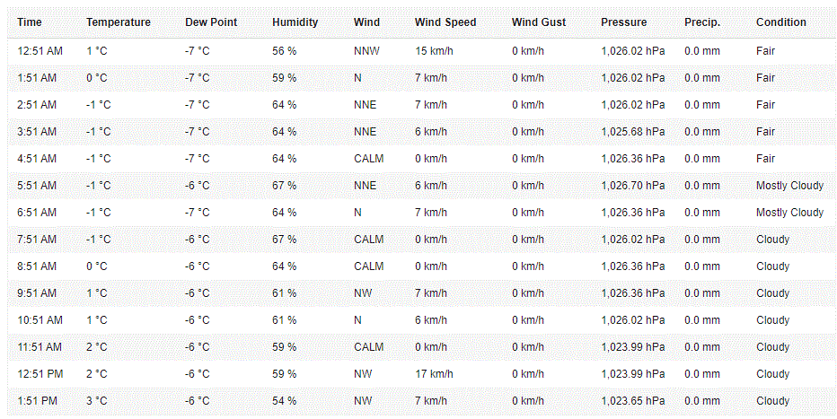
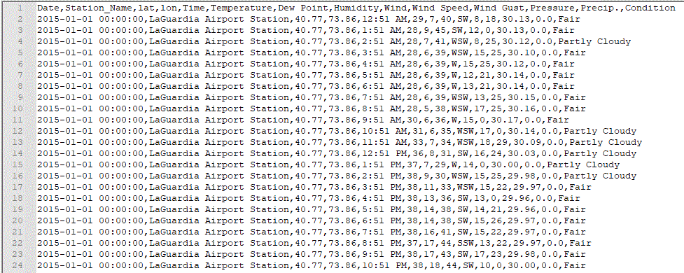

# Simple Wunderground Web Scraping 

Although exists N numbers of free weather data, in a recent project (you can read about it [here](https://github.com/rafa-rodriguess/ny_weather_impact_crash_uber_taxi)) I've opted to use Wunderground (https://www.wunderground.com).

The main reasons are:
Multiple stations in the same area/city
Data by hour
Well done condition classification

Unfortunately, the wunderground has disabled their API and we can no longer extract historical information from them.

As a study proposal only, we developed a web scraping able to automatically extract wunderground data and generate a local CSV file.

## How to use

### 01 - Decide which weather station to use.
For example, let´s use New York City Laguardia Airport Station.
The main web address is https://www.wunderground.com/weather/us/ny/new-york-city/KLGA

### 02 - Determinate the first and the last day of the history to be extracted
Lets say 01/01/2015 (dd/mm/yyyy) to 31/01/2015 (dd/mm/yyyy).

At the code, change the lines:

    startDate = datetime.strptime("01/01/2015", "%d/%m/%Y")
    endDate =  datetime.strptime("31/01/2015", "%d/%m/%Y")
    partial_url_address = "ny/new-york-city/KLGA"
    finalCsv = "wunderground.csv"
    sleepTime = 3

**where:**
startDate - first date to extract
endDate - last date to extract
partial_url_address - last part of the weather station URL from wunderground
finalCsv - local CSV file to be created
sleepTime - time, in seconds, to wait between days to extract

### 03 - Run the script

It uses ChromeDriver. You can read more and download the appropriate version [here](https://chromedriver.chromium.org/getting-started). **Remember to put the ChromeDriver in the same directory or change the code below:**

    driver = webdriver.Chrome("chromedriver.exe", chrome_options=chrome_options)

## What does this code do?

It goes through every single day of the determined range, navigates using ChromeDriver, and extracts the "Daily Observations"  table.

Each line of the table becomes a line in the CSV file, plus "Date", "Station Name" and "Geo-Location" info.

You may use this code for study purposes only. Do not use it abusively or in any kind of attack.
